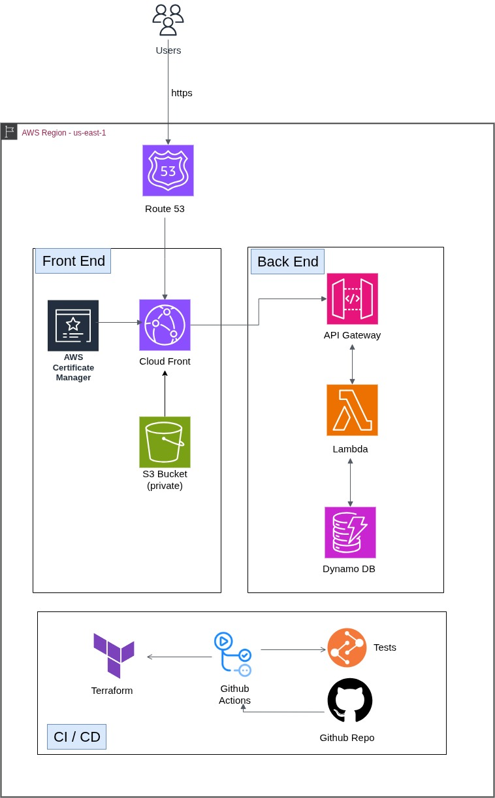

# Cloud Resume Challenge
This project is part of the Cloud Resume Challenge, a hands-on initiative designed to demonstrate foundational cloud skills by building and deploying a personal resume site using cloud-native technologies. The challenge spans front-end development, cloud infrastructure, CI/CD, and infrastructure-as-code practices.

# Goal of the project
The goal is to showcase not only a working static website hosted on AWS, but also the behind-the-scenes automation, scalability, and reliability of modern DevOps workflows — all while gaining real-world experience with AWS services.

# Project Architecture
Below is the architecture diagram of my cloud resume challenge project.

#### Deployment Region ####

- Hosted in **AWS us-east-1**

#### Frontend ####

-   Resume webpage (HTML, CSS, JS) stored in an **Amazon S3** bucket with **public access disabled**
-    Delivered via **Amazon CloudFront** for faster global access
-    **HTTPS** enabled with **AWS Certificate Manager (ACM)** SSL/TLS certificate
-    Custom domain and DNS managed through **Amazon Route 53**

#### Backend ####

-    Visitor count stored in **Amazon DynamoDB**
-    **AWS Lambda** function (Python/JavaScript) retrieves and increments the count
-    Lambda sits behind an **Amazon API Gateway**
-    Webpage calls API Gateway on page load to fetch and display updated count

#### Infrastructure as Code (IaC) ####

-    Managed using **Terraform**
-    Remote Terraform state stored in a separate S3 bucket with **S3 state locking** (no DynamoDB lock required)

#### CI/CD ####

-    Implemented using **GitHub Actions**
-    **Frontend:** On main branch updates → deploy to S3 → invalidate CloudFront cache
-    **Backend:** On Lambda code updates → run tests → deploy function

 

# Project Structure

# Technologies Used

1. **Amazon S3** - Stores the resume webpage and manages Terraform remote state
2. **Amazon CloudFront** - Caches and delivers the webpage for faster global access
3. **AWS Certificate Manager** - Enables HTTPS using an SSL/TLS certificate
4. **Amazon Route 53** - Manages custom domain and DNS routing
5. **Amazon DynamoDB** - Stores and updates the visitor count
6. **Amazon Lambda** - Runs serverless code to fetch and update the visitor count
7. **Amazon API Gateway** - Serves as the entry point to Lambda, handles routing and authentication
8. **Terraform** - Provisions AWS resources and manages infrastructure as code
9. **Github Actions** - Automates CI/CD for both frontend and backend deployments

# Implementation

# CI/CD Pipeline

# Learnings and Challenges
